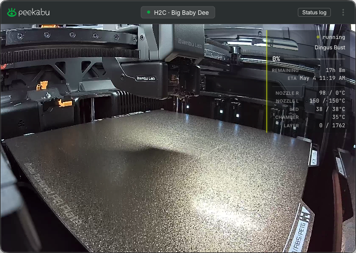

  

# Peekabu

A glanceable Mac menu bar monitor for [Bambu Lab](https://bambulab.com) 3D printers. Live progress, live camera, and OS notifications when a print finishes or needs attention.

## Install

Download the latest `.dmg` from the [Releases page](https://github.com/krizdingus/peekabu/releases/latest), drag **Peekabu** to `/Applications`, and double-click to launch.

Apple Silicon Mac required (macOS 12 Monterey or later).

## What it does

- Live print progress, time remaining, layer count, nozzle / bed / chamber temps
- Live camera feed via the printer's built-in RTSPS stream
- macOS notifications when a print finishes or hits an action-required HMS warning
- Per-print status log with export
- Multi-printer with one-click switcher

## What it doesn't

No print controls. Use Bambu Handy or Bambu Studio for pause / resume / stop. Those operations need Cloud OAuth that this app doesn't carry.

## Requirements

- macOS 12 (Monterey) or later, Apple Silicon
- Bambu Lab printer (X1C, X1E, H2D, H2S, or H2C)
- **LAN Only Liveview** enabled on the printer

The LAN Only Liveview toggle is independent of "LAN-only mode". Cloud and Bambu Handy stay enabled. See the [Bambu wiki](https://wiki.bambulab.com) for the toggle location on your model (typically Settings, then General or Network).

## Auto-update

Peekabu checks for updates on launch and via **Settings, then Check for updates...**. Updates download in the background and install on next quit.

## Roadmap

Things I might add if I feel like it. No timeline, no promises.

- **Print controls** (pause, resume, stop) via Bambu Cloud OAuth. The local LAN protocol blocks third-party command messages in Standard Mode, so this needs a Cloud login flow.
- **Capture**: stills, recordings, and timelapses from the camera feed.
- **Live streaming** to Twitch or YouTube directly from the camera feed.

## License

See [LICENSE](./LICENSE). Peekabu is closed-source freeware. Free for personal, non-commercial use. Redistribution of the unmodified bundle is permitted.
